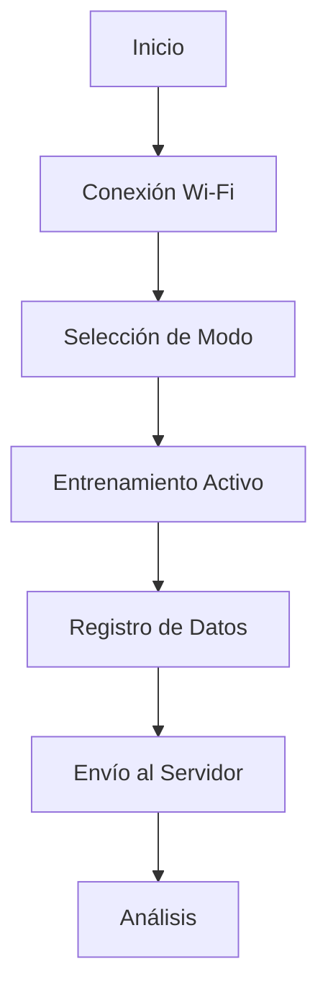

# Sistema de Entrenamiento en Taekwondo 🥋

[](https://www.python.org/downloads/)
[](https://micropython.org/)

Un sistema interactivo de entrenamiento en Taekwondo que utiliza sensores y microcontroladores para detectar golpes, medir tiempos de reacción y realizar seguimiento del progreso del deportista en tiempo real.

## 📝 Tabla de Contenidos

- [Descripción](#descripción)
- [Características](#características)
- [Componentes](#componentes)
- [Requisitos](#requisitos)
- [Instalación](#instalación)
- [Uso](#uso)
- [Modos de Entrenamiento](#modos-de-entrenamiento)
- [Diagrama de Flujo](#diagrama-de-flujo)
- [Contribuir](#contribuir)
- [Licencia](#licencia)

## 📖 Descripción

Este innovador sistema de entrenamiento en Taekwondo permite a los practicantes mejorar sus habilidades a través de diferentes modos de entrenamiento interactivo. Mediante sensores estratégicamente ubicados, el sistema detecta golpes en zonas específicas (cabeza, torso, pierna izquierda y derecha), registra tiempos de reacción y envía datos en tiempo real a un servidor para análisis posteriores.

## ✨ Características

### 🎯 Modos de Entrenamiento
- **Modo Normal**: Registro preciso de golpes en zonas específicas
- **Modo de Reacción**: Medición de tiempos de respuesta
- **Modo de Secuencia**: Práctica de combinaciones predefinidas

### 🔧 Características Técnicas
- Conectividad Wi-Fi para transmisión de datos en tiempo real
- Sistema de LED RGB para indicación visual de objetivos
- Almacenamiento y análisis de datos en la nube
- Compatible con ESP32 y Raspberry Pi Pico W

## 🛠 Componentes

El proyecto está compuesto por los siguientes archivos principales:

```
├── tkd_training-enhanced-esp32.py   # Script principal
├── Wifi_lib.py                      # Configuración Wi-Fi
├── secrets.py                       # Credenciales Wi-Fi
└── server/                          # Backend para datos
```

## 📋 Requisitos

### Hardware
- Microcontrolador ESP32
- Sensores de impacto
- LED RGB
- Cables y conectores
- Fuente de alimentación

### Software
- MicroPython
- Python 3.7+
- php para la conexion con el web service y html para el template del dash

## 🚀 Instalación

1. **Preparación del Microcontrolador**
```bash
# Instalar MicroPython en el dispositivo
esptool.py --port /dev/ttyUSB0 erase_flash
esptool.py --port /dev/ttyUSB0 write_flash -z 0x1000 micropython_firmware.bin
```

2. **Configuración Wi-Fi**
```python
# En secrets.py
secrets = {
    'ssid': 'tu_red_wifi',
    'password': 'tu_contraseña_wifi'
}
```

3. **Transferencia de Archivos**
```bash
# Usando ampy o similar
ampy --port /dev/ttyUSB0 put tkd_training-enhanced-esp32.py
ampy --port /dev/ttyUSB0 put Wifi_lib.py
ampy --port /dev/ttyUSB0 put secrets.py
```

## 📱 Uso

1. **Inicio del Sistema**
   - Conecta el dispositivo a la alimentación
   - Espera la conexión Wi-Fi (LED azul parpadeante)
   - LED verde fijo indica sistema listo

2. **Selección de Modo**
   - Presiona el botón de modo para cambiar entre:
     - 1 parpadeo: Modo Normal
     - 2 parpadeos: Modo de Reacción
     - 3 parpadeos: Modo de Secuencia

3. **Durante el Entrenamiento**
   - Sigue las indicaciones del LED RGB
   - Golpea las zonas señaladas
   - Observa el feedback instantáneo

## 🎮 Modos de Entrenamiento

### Modo Normal
- Registro libre de golpes
- Feedback inmediato por zona
- Estadísticas de potencia y precisión

### Modo de Reacción
- Indicadores aleatorios
- Medición de tiempo de respuesta
- Análisis de velocidad

### Modo de Secuencia
- Combinaciones predefinidas
- Progresión de dificultad
- Evaluación de memoria muscular

## 🔄 Diagrama de Flujo



## 🤝 Contribuidores
- **Mauricio Gutierrez** - _desarrollador_ -
- **Oscar Ortiz** - _desarrollador_ -
- **Gabriel Choque** - _desarrollador_ -
- **Ariel Poma** - _desarrollador_ - [Ariek P](https://github.com/AriekP)
